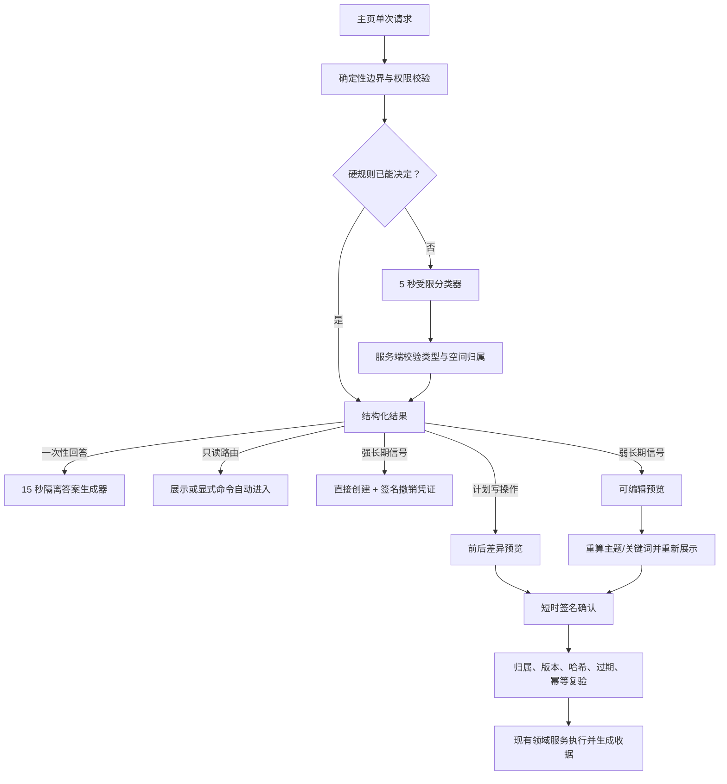

# 主页调度 Agent：完整落地与三维对抗性审查

| 项目 | 内容 |
| --- | --- |
| 日期 | 2026-08-09 |
| 审查基线 | 主页调度与一次性问答完整实现后的产品状态 |
| 范围 | 完整使用流程、交互体验、Agent 化、安全与数据边界 |
| 证据 | 后端单元/集成测试、前端契约/组件测试、生产构建、关键 E2E |

## 1. 最终产品定义

主页对话框不是缩小版 ChatGPT，也不是“创建学习空间”的自然语言表单。它是 RefineQ 的 supervisor：接收一句话，判断这件事应该现在完成、进入哪个已有空间、比较哪些空间、先预览哪项写操作，还是建立长期学习任务。

主页只保存当前浏览器组件中的一个 `latestResult`。它没有消息历史、会话列表、跨设备恢复或服务端正文记录。刷新、离开主页、退出登录和切换用户都会清除结果。这不是功能缺失，而是防止临时问题被误写成长期学习状态的核心边界。

服务端只返回六种类型：

1. `direct_answer`：稳定概念解释、本次粘贴文本的总结/翻译/改写、一次性学习建议；
2. `open_workspace`：显式打开、语义匹配或跨空间排序后的目标空间；
3. `workspace_action`：改期、调整会话时长等需要确认的中风险操作；
4. `propose_workspace`：信号仍有歧义的新空间预览；
5. `clarify`：一次澄清，最多三个明确选项；
6. `out_of_scope`：实时事实、高风险建议、破坏性动作和明显非学习任务，同时提供回收入口。

## 2. 已落地的完整流程

### 2.1 一次性回答

- 分类器最多看到请求前 500 字符；最长 12000 字符的完整正文只进入答案生成器。
- 答案生成器不接收空间摘要、资料、计划、对话历史或工具。
- 回答标出依据是通用知识还是本次粘贴文本，并声明未使用个人资料。
- 结果不写 workspace、learning、materials、sessions 或 journey events，不改变掌握度、计划、复习和 `NextAction`。
- 用户可以复制、提新问题或转为长期目标；答案正文不会进入长期学习记录。

### 2.2 已有空间与跨空间调度

- “打开/进入/继续 + 唯一空间名”由规则识别，服务端返回 `auto_navigate=true`；前端不重新猜语义。
- 其他匹配只展示卡片，由用户点击进入。
- 候选最多 8 个，按活跃时间排序；被明确点名的旧空间始终纳入。
- 归档空间默认排除，但被明确点名时仍可进入；同名空间和计划修改目标都返回真实候选，不做静默猜测。
- 8 个空间的摘要由一次学习字段投影和一次资料状态批量读取生成；数据库不读取 attempts、evidence 或题目历史，也不循环调用完整 `next_action`。
- 每个空间仍复用同一个 `select_next_action`。跨空间排序为：到期复习 > 今日会话 > 截止风险 > 临近截止但缺资料 > 普通行动。模型只能解释，不能改顺序。
- 无资料空间的行动是“上传资料”，不会产生收益接近零的通用模板练习。

### 2.3 新空间与受控写入

- 明确学习对象 + 日期/考试/每天分钟数，或明确跨天承诺，属于强信号：保持“一句话开始”，直接创建并进入。
- 缺少时间约束、对象宽泛或意图仍有歧义，属于弱信号：先展示标题、目标、截止日、每天分钟数、主题和资料建议。
- 标题、目标、截止日和每日时间可以编辑。目标变化时服务端从零重算学科、主题和关键词，为新字段重新签名；前端先展示重算结果，用户第二次确认后才执行，避免“看见旧语义、创建新目标”。
- 强信号创建后返回短时、owner-bound 的撤销凭证。撤销会真正删除刚创建且仍未变化的空间；改名、上传资料或产生学习状态后，状态哈希变化，服务端拒绝撤销并保留空间。
- 首页只开放单会话改期和时长调整，不开放删除、归档、大范围重排或目标/考试日自动修改。
- HMAC 令牌绑定用户、操作、目标、提案哈希、学习版本/空间快照、过期时间和 nonce。
- 执行前复验所有权、版本和幂等键；状态变化时拒绝旧提案。写入仍由现有 `LearningService` / `WorkspaceService` 完成。

## 3. 完整流程对抗性审查

| 攻击或失败方式 | 错误设计的后果 | 当前防线 | 剩余风险 |
| --- | --- | --- | --- |
| 一次性提问误建空间 | 空间膨胀、计划污染 | 强/弱长期信号由硬规则决定，模型不能升级 | 口语和混合语言仍需扩充评估集 |
| 长期目标被当问答 | 没有计划、资料和复习 | 对象 + 时间/跨天承诺优先 | “开学前”等隐含日期需持续补齐 |
| 无资料推荐弱项练习 | 只能生成通用题 | 复用资料感知 `NextAction`，先上传 | 需观察资料建议是否足够具体 |
| 粘贴文本注入删除指令 | 数据变成工具命令 | 破坏性边界先判断；答案器无工具 | 模型可能复述文字，但不能执行 |
| 模型伪造其他用户空间 | 越权泄露 | ID 必须属于服务端候选；确认再验 owner | 未发现已知绕过路径 |
| 旧请求晚于新请求 | 旧答案覆盖新结果 | abort + request ID + auth token 三重校验 | 不尊重 abort 的代理只会浪费计算 |
| 多标签并发重复确认 | 计划被写两次 | owner-scoped 事务锁 + token + 版本 + 幂等收据 | 同一幂等键并发请求一成一回放；不同提案一成一冲突 |
| 编辑后复用旧 token | 执行未精确确认字段 | revise 后为精确字段重新签名 | revise 与 confirm 间变化会被快照拒绝 |
| “撤销”只回到上一页 | 用户误以为空间已删除 | 签名撤销端点 + 创建态哈希 + 幂等收据 | 空间变化后必须转为显式删除流程 |
| 登出后迟到快照复活旧空间 | 跨账号显示旧状态 | 每次异步提交前复验 auth token；登出同步清空 auth ref | 已完成请求仍消耗少量网络资源，但不能提交 UI 状态 |
| 模型未配置/超时 | 入口死路或错误建空间 | 硬规则、显式导航、跨空间排序继续可用；管理员进入配置，学习者进入已有/新空间 | 一次性答案无离线替代，只能重试 |
| 问答污染北极星 | 活跃人数和闭环虚高 | 独立 home event 域 | 管理看板不能把两域直接相加 |

## 4. 交互体验审查

### 4.1 已关闭的问题

- 首页文案现在同时覆盖“今天先做什么”和“一次性解释”，不再暗示输入必然建空间。
- 任一时刻只有一个结果卡和一个主行动；新请求立即替换旧卡。
- 结果不进入 URL、localStorage 或 sessionStorage；刷新和返回主页不恢复旧答案。
- 只有服务端 `auto_navigate` 为真才自动进入，前端不根据置信度或文本猜测。
- 失败后保留输入并把焦点还给文本框；Enter 提交，Shift+Enter 换行。
- 空间预览的核心约束可编辑；修改后先看到重算的学科和主题，再二次确认。
- 路由通知中的“撤销”语义一致：切换/复用时回到上一空间，刚创建时真正删除未变化的新空间。
- 结果卡在窄屏折为单列，主操作宽度 100%，交互目标不小于 44px。
- 加载和错误使用 `aria-live`；完成后焦点移到卡片标题；减少动态效果会关闭动画。

### 4.2 仍需真实数据验证

1. 六类结果是否仍让首次用户觉得复杂；UI 已隐藏内部 kind，但需看澄清率和改选率。
2. 8 个候选是否足够；这是延迟与质量的首版上限，不是固定真理。
3. “转为长期任务”是否会被误解为保存答案；当前只转目标摘要。
4. 编辑预览增加控制感，也增加确认成本；独立事件域已经区分确认、显式取消与十分钟后过期，下一步用真实数据校准默认值。
5. 中英混输、语音转写、错别字和课程别名是现实路由的主要威胁。

## 5. Agent 化审查

它已经具备一个受限但完整的闭环：观察多个空间的真实状态，基于确定性目标函数选行动，解释理由，在授权后调用现有工具，验证版本并保存收据。模型只承担难以规则化的语义压缩和表达，不拥有权限、状态真相或优先级。

它仍刻意不做以下事情：后台主动运行、发送外部通知、保存主页长期记忆、从一次性答案推导画像、搜索实时网络、自动大范围重排、改变目标/考试日，以及把模型置信度当写权限。

最危险的四种 Agent 退化已被针对性关闭：

1. **模型接管策略**：会使相同状态产生不同下一行动；当前用确定性排序。
2. **上下文无限膨胀**：会增加成本和跨空间泄漏；当前只给最多 8 个摘要，答案器完全不看摘要。
3. **执行与审计脱节**：会受过期状态和重复点击影响；当前用签名、版本和收据。
4. **指标替代价值**：问答次数增长不等于学习；当前主页指标与资料约束学习闭环分离。

## 6. 第一性原理方案

### 原理一：长期状态只为未来决策服务

不会改变未来计划、练习、复习或证据判断的信息不应持久化。由此得到“一次性答案只在客户端存在”，也得到“转长期任务只保留用户确认的目标约束”。

### 原理二：事实、决策、表达必须分层

- 事实：owner-scoped workspace、计划、资料状态、学习证据和版本；
- 决策：资料门、`NextAction`、候选上限、风险和确认规则；
- 表达：模型分类理由、一次性答案和卡片文案。

表达层可以降级，事实和决策仍必须成立。模型不可用时确定性能力继续工作，就是这一原则的直接结果。

### 原理三：每个页面时刻只有一个首要承诺

主页承诺“把一句话变成正确下一行动”，所以只保留一张结果卡；空间今日页承诺“现在做这一项”，所以只保留一个 `NextAction`。第二个并列 P0 会把决策负担退还给用户。

### 原理四：写权限来自可验证授权，不来自置信度

再高的模型置信度也不能证明用户接受修改。中风险写操作必须有可见差异、精确签名、短时效、版本和幂等键；高风险操作第一版不从自然语言入口执行。

### 原理五：北极星必须能由真实数据计算

“掌握度校准误差”需要真实考试或教师评分，当前产品没有这一真值，因此不能作为现阶段北极星。当前可计算的核心仍是“资料约束学习闭环完成率”和从意图到资料约束反馈的时间；主页另看结果分布、空间卡进入率、提案确认/取消/过期、澄清成功、越界回收和 P50/P90。未来若用户自愿录入真实成绩，可将校准误差作为外部效度指标，但不能伪装成当前可算指标。

## 7. 验证与后续优先级

自动化已覆盖硬规则、双语合成集、prompt injection、500/12000 字符隔离、答案器无 workspace 上下文、direct answer 不改变学习域、强/弱空间分流、目标编辑后的语义重算与二次确认、token 篡改/过期/owner 绑定、并发幂等确认、真实撤销及状态变化拒绝、计划确认前后版本、8 空间读取上限、指标隔离、六类卡片、旧请求与旧登录态防护、移动端/焦点，以及强信号、弱信号、一次性问答刷新清除、转换冲突恢复、真实撤销和迟到快照五类 E2E。

下一步 P1 应做生产校准，而不是扩大权限：补齐不含原文的主动改选与越界回收事件，扩充混输和语音样本，完善主页指标看板，测试预览默认值和理由长度，并探索自愿录入真实考试结果。主页调度事件按用户最多保留 1000 条，不能用无限埋点换取“可观测性”。

只有真实数据证明需要时，P2 才考虑大范围计划重排、目标/截止日修改、主动后台 Agent、外部通知、主页文件上传、联网搜索或跨设备一次性历史。这些能力会扩大隐私、权限和恢复语义，不能因为模型“看起来能做”就提前加入。

## 8. 最终判断

主页现在承担的是正确的调度职责：轻任务当场完成，长期任务进入长期状态，跨空间问题基于真实状态排序，写操作先预览再授权。它没有通过保存更多上下文来显得更智能，而是通过减少错误状态、把权力留在确定性策略和用户确认中，变成了更可靠的 Agent。

下一阶段的成功标准不是“主页问答更多”，而是用户更快抵达正确行动，同时非预期创建、错误空间、无资料低收益练习和未经确认写入持续接近零。
